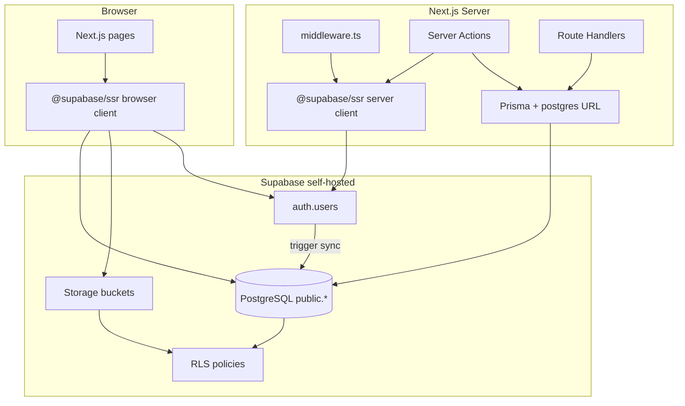

# Fase 2 — Supabase completo (Auth + Storage + Client + RLS)

> **Projeto:** Ecommerce Bordadeiras  
> **Supabase:** self-hosted em `https://supabase.bordadeiras.cloud`  
> **Data:** 2026-06-04  
> **Pré-requisito:** Fase 1 concluída (Postgres + migrations foundation + RLS baseline)

---

## 1. Objetivo

Substituir **NextAuth v5 (JWT + Credentials + bcrypt em `public.User`)** e **MinIO (S3 SDK)** por:

| Camada | De | Para |
|--------|----|------|
| Sessão | NextAuth JWT cookie | `@supabase/ssr` cookie session |
| Identidade | `User.passwordHash` + bcrypt | Supabase Auth (`auth.users`) |
| Admin | `User.role` no JWT NextAuth | `app_metadata.role` + `public.User.role` |
| Arquivos | MinIO `@aws-sdk/client-s3` | Supabase Storage (`product-images`, `uploads`) |
| Acesso DB browser | Bloqueado (RLS sem policies) | Policies granulares (catálogo público, own-data, admin) |

**Prisma permanece** para server actions, webhooks e admin batch — via `DATABASE_URL` (postgres) ou `SUPABASE_SERVICE_ROLE_KEY` (bypass RLS). O client Supabase no browser usa `anon` + JWT do usuário.

---

## 2. Inventário atual (baseline)

### 2.1 Auth — NextAuth

| Arquivo | Função |
|---------|--------|
| `src/auth.ts` | NextAuth config: Credentials provider, JWT strategy, role no token |
| `src/middleware.ts` | Protege `/admin`, `/conta`, `/pedidos` via `auth()` wrapper |
| `src/lib/admin-access.ts` | `hasAdminAccess()` — `Role.ADMIN` ou `ADMIN_EMAIL` (dev only) |
| `src/lib/admin-auth.ts` | `requireAdmin()`, `getAdminActor()`, `requireAdminApi()` |
| `src/lib/verify-credentials.ts` | bcrypt vs `User.passwordHash` + bootstrap env |
| `src/lib/authenticate-user.ts` | Login flow, email verification gate |
| `src/lib/register-user.ts` | Cria `User` Prisma + envia código verificação |
| `src/lib/admin-bootstrap.ts` | `ensureAdminUser()` idempotente via env |
| `src/actions/auth/login.ts` | Server action → `signIn("credentials")` |
| `src/actions/auth/register.ts` | Server action → `registerUser` + auto signIn |
| `src/app/api/auth/[...nextauth]/route.ts` | Handlers NextAuth |
| `src/app/api/auth/register/route.ts` | REST register (sem auto-login) |
| `src/app/api/auth/forgot-password/route.ts` | Reset via `PasswordResetToken` |
| `src/app/api/auth/reset-password/route.ts` | Aplica nova senha bcrypt |
| `src/app/api/auth/verify-email/route.ts` | Marca `User.emailVerified` |
| `src/types/next-auth.d.ts` | Tipos Session/JWT com `role` |
| `src/components/providers/session-provider.tsx` | `SessionProvider` next-auth/react |

**Dependências:** `next-auth@5.0.0-beta.25`, `@auth/prisma-adapter` (instalado, **não wired**).

**Modelo Prisma `User`:**

```prisma
model User {
  id            String    @id @default(cuid())
  email         String    @unique
  passwordHash  String?
  role          Role      @default(USER)
  emailVerified DateTime?
  // ... relations
}
```

**Gap vs Supabase Auth:** `User.id` é **cuid**, `auth.users.id` é **UUID**. Todas as FKs (`Order.userId`, `Address.userId`, etc.) apontam para cuid. **Não** trocar PK na Fase 2 — adicionar coluna ponte `authUserId UUID UNIQUE` (migration `20250604100000_fase2_auth_storage.sql`).

### 2.2 Middleware e rotas admin

| Rota / guard | Mecanismo |
|--------------|-----------|
| `src/middleware.ts` | `auth()` + `hasAdminAccess(session.user)` |
| `src/app/admin/layout.tsx` | `requireAdmin()` server-side |
| `src/actions/admin/_utils.ts` | Wrapper `withAdmin()` |
| Upload APIs | `requireAdminApi()` |
| ~15 server actions admin | `requireAdmin()` via `_utils` |

Produção exige `role === ADMIN` no JWT; dev aceita `ADMIN_EMAIL` fallback.

### 2.3 Storage — MinIO/S3

| Arquivo | Função |
|---------|--------|
| `src/lib/storage.ts` | S3Client, presigned PUT, `uploadBuffer`, `deleteObject`, key builders |
| `src/app/api/uploads/direct/route.ts` | Multipart upload server-side (admin) |
| `src/app/api/uploads/signed/route.ts` | Presigned URL produtos (admin) |
| `src/app/api/uploads/signed/banner/route.ts` | Presigned URL banners (admin) |

**Env atuais:** `S3_ENDPOINT`, `S3_PUBLIC_URL`, `S3_BUCKET` (default `bordadeiras`), `S3_ACCESS_KEY`, `S3_SECRET_KEY`.

**Key layout:**

- `products/{productId}/{timestamp}-{filename}`
- `banners/{bannerId}/{timestamp}-{filename}`

**URLs persistidas em:** `ProductImage.url`, `StorefrontBanner.imageUrl`, `Product.images` (JSON legado).

`deleteObject` existe mas **não é chamado** em nenhum action ainda.

### 2.4 RLS baseline

Arquivo: `supabase/migrations/20250603120000_rls_baseline.sql`

- RLS **habilitado** em 28 tabelas
- **Zero policies** → anon/authenticated bloqueados no PostgREST
- Prisma/postgres/service_role **não afetados**
- Comentário reservado: policy `public_read_active_products` (desabilitada)

### 2.5 Supabase client

- Env placeholders em `env.example`: `NEXT_PUBLIC_SUPABASE_URL`, `NEXT_PUBLIC_SUPABASE_ANON_KEY`, `SUPABASE_SERVICE_ROLE_KEY`
- **Nenhum** `@supabase/ssr` ou `@supabase/supabase-js` no `package.json` ainda
- MCP configurado em `.cursor/mcp.json` → `https://supabase.bordadeiras.cloud/mcp`

---

## 3. Arquitetura alvo



**Regra de ouro (security checklist Supabase):**

- Autorização em RLS/JWT: **`app_metadata.role`**, nunca `user_metadata`
- `service_role` / `DATABASE_URL` postgres: **somente server**, nunca `NEXT_PUBLIC_*`
- Storage upsert: policies **INSERT + SELECT + UPDATE** (migration já inclui)

---

## 4. Plano de execução

### Etapa 0 — Pré-requisitos e backup

1. Backup Postgres + bucket MinIO (`mc mirror` ou console).
2. Obter chaves no Studio → Settings → API:
   - `anon` / publishable key
   - `service_role` / secret key
3. Confirmar Site URL e Redirect URLs em Auth settings:
   - `https://loja.bordadeiras.com.br`
   - `http://localhost:3000` (dev)
4. Aplicar migration Fase 2:
   ```bash
   supabase db push --db-url "$DATABASE_URL"
   # ou via Studio SQL editor / psql
   ```

### Etapa 1 — Dependências e clients Supabase

```bash
npm install @supabase/supabase-js @supabase/ssr
npm uninstall next-auth @auth/prisma-adapter   # após cutover completo
```

**Criar:**

| Arquivo | Responsabilidade |
|---------|------------------|
| `src/lib/supabase/env.ts` | Valida `NEXT_PUBLIC_SUPABASE_URL`, keys |
| `src/lib/supabase/client.ts` | `createBrowserClient()` |
| `src/lib/supabase/server.ts` | `createServerClient()` com cookies Next 15 |
| `src/lib/supabase/middleware.ts` | `updateSession()` para refresh token |
| `src/lib/supabase/admin.ts` | `createClient(SERVICE_ROLE)` — server only |

Padrão `@supabase/ssr` (App Router): [Creating a Supabase client for SSR](https://supabase.com/docs/guides/auth/server-side/nextjs).

### Etapa 2 — Auth: NextAuth → Supabase Auth

#### 2.1 Modelo de dados

1. Coluna `User.authUserId UUID UNIQUE` — **SQL migration já criada**; espelhar em `prisma/schema.prisma`:
   ```prisma
   authUserId String? @unique @db.Uuid
   ```
2. Trigger `handle_auth_user_sync` — cria/atualiza `public.User` em INSERT/UPDATE de `auth.users`.
3. Manter `User.role` como source of truth para Prisma; espelhar em `app_metadata.role` no login/admin promote.

#### 2.2 Sign up

Substituir `registerUser()` Prisma-only por:

```typescript
const supabase = await createClient();
const { data, error } = await supabase.auth.signUp({
  email,
  password,
  options: {
    data: { name }, // user_metadata — display only, NOT for auth
    emailRedirectTo: `${origin}/auth/callback`,
  },
});
```

- Supabase envia e-mail de confirmação (configurar SMTP no Supabase **ou** manter fluxo custom via hook).
- Trigger preenche `public.User`; validar que `authUserId` foi linkado.
- **Decisão:** desativar verificação custom (`VerificationToken` table) após cutover, ou manter paralelo durante transição.

#### 2.3 Sign in

Substituir `signIn("credentials")` por:

```typescript
await supabase.auth.signInWithPassword({ email, password });
```

Server action flow:

1. `signInWithPassword` via server client (set cookies)
2. Buscar `public.User` por email ou `authUserId`
3. Se admin: garantir `app_metadata.role = 'ADMIN'` via Admin API (`supabase.auth.admin.updateUserById`) quando `User.role === ADMIN`
4. Redirect via `resolveLoginRedirect()` (manter lógica existente)

#### 2.4 Sign out

```typescript
await supabase.auth.signOut();
```

Substituir `signOut` de next-auth/react nos componentes.

#### 2.5 Session no server

| Antes | Depois |
|-------|--------|
| `auth()` de `@/auth` | `createClient()` + `supabase.auth.getUser()` |
| `session.user.id` (cuid) | `user.id` (UUID auth) + lookup `public.User` para cuid FK |
| `session.user.role` | `user.app_metadata.role` **ou** `public.User.role` |

**Helper novo:** `src/lib/session.ts`

```typescript
export async function getAppSession(): Promise<{
  authUserId: string;
  userId: string;      // cuid — para Prisma FKs
  email: string;
  role: Role;
} | null>
```

#### 2.6 Admin role

| Mecanismo | Uso |
|-----------|-----|
| `public.User.role = ADMIN` | Prisma, audit, bootstrap |
| `auth.users.raw_app_meta_data.role = 'ADMIN'` | RLS `is_admin()`, JWT claims |
| `ADMIN_EMAIL` env | Bootstrap seed only — **remover** fallback em produção após migração |

**Promover admin:**

```typescript
await adminClient.auth.admin.updateUserById(authUserId, {
  app_metadata: { role: 'ADMIN' },
});
await prisma.user.update({ where: { authUserId }, data: { role: 'ADMIN' } });
```

#### 2.7 Middleware

Reescrever `src/middleware.ts`:

1. Chamar `updateSession(request)` (refresh cookie)
2. `supabase.auth.getUser()` — **never trust getSession alone**
3. Para `/admin`: checar `app_metadata.role === 'ADMIN'` OR `User.role` via claim sync
4. Manter redirects `/login?callbackUrl=`

Remover wrapper `auth()` do NextAuth.

#### 2.8 Password reset

Substituir fluxo custom (`PasswordResetToken` + bcrypt) por:

- `supabase.auth.resetPasswordForEmail(email, { redirectTo })`
- Página `/auth/update-password` com `supabase.auth.updateUser({ password })`

Rotas a deprecar: `forgot-password`, `reset-password` (custom).

#### 2.9 Remover NextAuth (cutover final)

| Remover / alterar |
|-------------------|
| `src/auth.ts` |
| `src/app/api/auth/[...nextauth]/route.ts` |
| `src/types/next-auth.d.ts` |
| `src/components/providers/session-provider.tsx` → noop ou remover |
| Env: `AUTH_SECRET`, `AUTH_URL` (substituídos por Supabase JWT secret no stack) |

Manter temporariamente: `Account`, `VerificationToken`, `PasswordResetToken` tables (arquivar depois).

### Etapa 3 — Storage: MinIO → Supabase Storage

#### 3.1 Buckets (migration SQL)

| Bucket | Público | Uso |
|--------|---------|-----|
| `product-images` | Sim | Produtos, banners — URLs no storefront |
| `uploads` | Não | Uploads admin privados (opcional) |

**Recomendação:** migrar para bucket **`product-images`** (público). Manter paths:

- `products/{productId}/...`
- `banners/{bannerId}/...`

#### 3.2 Reescrever `src/lib/storage.ts`

```typescript
// Nova interface — mesma assinatura pública para minimizar diff
export async function uploadBuffer({ key, body, contentType }) {
  const supabase = createAdminClient(); // service_role
  const { error } = await supabase.storage
    .from(BUCKET)
    .upload(key, body, { contentType, upsert: true });
  return getPublicObjectUrl(key);
}

export function getPublicObjectUrl(key: string) {
  return `${SUPABASE_URL}/storage/v1/object/public/product-images/${key}`;
}

export async function getSignedUploadUrl({ key, contentType, expiresIn }) {
  const supabase = createAdminClient();
  const { data } = await supabase.storage
    .from(BUCKET)
    .createSignedUploadUrl(key); // ou createSignedUrl para PUT
  return { uploadUrl: data.signedUrl, publicUrl: getPublicObjectUrl(key), key };
}
```

**Alternativa client-side (futuro):** admin browser upload direto com JWT admin + storage policies (sem round-trip pelo Next).

#### 3.3 APIs de upload

| Rota | Mudança |
|------|---------|
| `api/uploads/direct` | Trocar `uploadBuffer` → Supabase admin client |
| `api/uploads/signed` | Trocar presigned S3 → `createSignedUploadUrl` |
| `api/uploads/signed/banner` | Idem |

Auth guard permanece `requireAdminApi()` (session Supabase).

#### 3.4 Descomissionar MinIO

Após validação:

- Remover serviço `minio` de `docker-compose.prod.yml`
- Remover env `S3_*`
- Remover `@aws-sdk/client-s3`, `@aws-sdk/s3-request-presigner`

### Etapa 4 — RLS e Prisma coexistência

Migration `20250604100000_fase2_auth_storage.sql` adiciona:

| Grupo | Policies |
|-------|----------|
| Catálogo | SELECT público: Product, ProductImage, Category, banners, trust, blog publicado |
| Customer | Own rows: User profile, Address, Order, OrderItem, Notification |
| Admin | FOR ALL em 24 tabelas via `is_admin()` |
| Storage | Public read `product-images`; admin CRUD both buckets |

**service_role bypass:** Prisma com `DATABASE_URL` (user postgres) bypassa RLS. Route handlers que adotarem Supabase client server-side com service role também bypassam.

**Adoção gradual supabase-js no storefront:**

1. Fase 2a: Prisma server components (sem mudança)
2. Fase 2b: Client components leem catálogo via supabase-js (RLS `public_read_*`)
3. Fase 2c: Conta/pedidos via supabase-js + RLS own-data

### Etapa 5 — Migração de usuários existentes

Script one-shot `scripts/migrate-users-to-supabase-auth.ts`:

```
Para cada User com passwordHash:
  1. admin.createUser({ email, password, email_confirm: !!emailVerified })
  2. app_metadata.role = user.role
  3. UPDATE User SET authUserId = created.id
Usuários OAuth (Account table): criar manualmente ou invite
Admin bootstrap: ensureAdminUser → sync auth + app_metadata
```

**Senhas:** Supabase Auth usa bcrypt próprio — **não** importar hash bcrypt existente via API padrão. Opções:

- A) Forçar reset de senha no cutover
- B) Usar `admin.createUser` com senha temporária + e-mail
- C) Custom SQL em `auth.users` (não recomendado)

### Etapa 6 — Validação

| Teste | Esperado |
|-------|----------|
| Sign up + confirm email | `auth.users` + `public.User.authUserId` |
| Login admin | `/admin` acessível, `is_admin()` true |
| Login customer | `/conta` ok, `/admin` redirect |
| Upload produto admin | Objeto em `product-images`, URL pública funciona |
| Storefront anon | SELECT products via supabase-js |
| Prisma webhook MP | Sem regressão (postgres bypass) |
| `supabase db advisors` | Zero critical security issues |

---

## 5. Variáveis de ambiente

### Adicionar / obrigatórias Fase 2

| Variável | Onde | Descrição |
|----------|------|-----------|
| `NEXT_PUBLIC_SUPABASE_URL` | App (browser + server) | `https://supabase.bordadeiras.cloud` |
| `NEXT_PUBLIC_SUPABASE_ANON_KEY` | App (browser + server) | Chave anon/publishable |
| `SUPABASE_SERVICE_ROLE_KEY` | **Server only** | Admin API, storage server upload, bypass RLS |

### Manter

| Variável | Notas |
|----------|-------|
| `DATABASE_URL` | Prisma — postgres direct |
| `ADMIN_EMAIL` / `ADMIN_PASSWORD` | Seed/bootstrap only |
| `NEXT_PUBLIC_APP_URL` | Redirects auth |

### Remover após cutover

| Variável |
|----------|
| `AUTH_SECRET` |
| `AUTH_URL` |
| `S3_ENDPOINT`, `S3_PUBLIC_URL`, `S3_BUCKET`, `S3_ACCESS_KEY`, `S3_SECRET_KEY`, `S3_REGION` |

### Supabase Dashboard (self-hosted)

- Auth → Site URL, Redirect URLs
- Auth → Email templates (ou SMTP relay)
- Storage → buckets criados pela migration (confirmar visibilidade)

Atualizar: `env.example`, `env.production.example`, `docs/ENV_REFERENCE.md`.

---

## 6. Lista de arquivos (file-by-file)

### Criar

| Arquivo | Ação |
|---------|------|
| `src/lib/supabase/env.ts` | Validar env vars |
| `src/lib/supabase/client.ts` | Browser client |
| `src/lib/supabase/server.ts` | Server client + cookies |
| `src/lib/supabase/middleware.ts` | Session refresh |
| `src/lib/supabase/admin.ts` | Service role client |
| `src/lib/session.ts` | Abstração sessão (substitui `auth()`) |
| `src/app/auth/callback/route.ts` | OAuth/email confirm callback |
| `src/app/auth/update-password/page.tsx` | Reset password UI |
| `scripts/migrate-users-to-supabase-auth.ts` | Migração usuários |
| `scripts/migrate-minio-to-supabase-storage.ts` | Migração blobs |
| `supabase/migrations/20250604100000_fase2_auth_storage.sql` | **Criado** |
| `prisma/migrations/YYYYMMDD_auth_user_id/` | Espelhar coluna `authUserId` |

### Alterar

| Arquivo | Mudança |
|---------|---------|
| `prisma/schema.prisma` | `authUserId String? @unique @db.Uuid` |
| `package.json` | + `@supabase/ssr`, `@supabase/supabase-js`; − `next-auth` (final) |
| `src/middleware.ts` | Supabase session + guards |
| `src/lib/storage.ts` | MinIO → Supabase Storage |
| `src/lib/admin-auth.ts` | `getUser()` Supabase + Prisma lookup |
| `src/lib/admin-access.ts` | Claims `app_metadata.role` |
| `src/lib/verify-credentials.ts` | **Remover** ou stub deprecated |
| `src/lib/register-user.ts` | `signUp` Supabase |
| `src/lib/authenticate-user.ts` | `signInWithPassword` |
| `src/actions/auth/login.ts` | Supabase signIn |
| `src/actions/auth/register.ts` | Supabase signUp |
| `src/actions/admin/_utils.ts` | Usar `getAppSession()` |
| `src/components/layout/header.tsx` | `signOut` Supabase |
| `src/components/admin/admin-sidebar.tsx` | Idem |
| `src/components/checkout/checkout-identify-form.tsx` | Supabase client login |
| `src/components/providers/app-providers.tsx` | Remover AuthSessionProvider |
| `src/app/api/uploads/*/route.ts` | Storage backend |
| `src/app/(storefront)/conta/page.tsx` | `getAppSession()` |
| `src/app/(storefront)/checkout/page.tsx` | Idem |
| `src/app/api/orders/route.ts` | Idem |
| `src/actions/orders.ts` | Idem |
| `env.example`, `.env.example`, `env.production.example` | Supabase vars, deprecate S3/Auth |
| `docker-compose.prod.yml` | Remover MinIO (final) |
| `docs/ENV_REFERENCE.md` | Atualizar tabela |

### Remover (cutover final)

| Arquivo |
|---------|
| `src/auth.ts` |
| `src/app/api/auth/[...nextauth]/route.ts` |
| `src/types/next-auth.d.ts` |
| `src/components/providers/session-provider.tsx` |
| `src/app/api/auth/forgot-password/route.ts` (se usar Supabase reset) |
| `src/app/api/auth/reset-password/route.ts` |

---

## 7. Migração MinIO → Supabase Storage (script outline)

Arquivo sugerido: `scripts/migrate-minio-to-supabase-storage.ts`

```typescript
/**
 * Outline — implementar com tsx
 *
 * Env: S3_* (source), NEXT_PUBLIC_SUPABASE_URL, SUPABASE_SERVICE_ROLE_KEY
 *      DATABASE_URL (rewrite URLs in DB)
 *
 * 1. Init S3Client (source MinIO) + Supabase admin client
 * 2. List objects: mc ls s3://bordadeiras-uploads --recursive
 *    ou S3 ListObjectsV2Command({ Bucket, Prefix: '' })
 * 3. For each object key:
 *    a. Download Body stream → Buffer
 *    b. supabase.storage.from('product-images').upload(key, buffer, {
 *         contentType, upsert: true
 *       })
 *    c. Log success/skip/error
 * 4. Rewrite DB URLs:
 *    - ProductImage.url: REPLACE(S3_PUBLIC_URL, SUPABASE_PUBLIC_BASE)
 *    - StorefrontBanner.imageUrl: idem
 *    - Product.images JSON: batch update
 *    SQL example:
 *      UPDATE "ProductImage"
 *      SET url = REPLACE(url, 'https://storage.bordadeiras.com.br/bordadeiras-uploads',
 *                              'https://supabase.bordadeiras.cloud/storage/v1/object/public/product-images')
 *      WHERE url LIKE 'https://storage.bordadeiras.com.br/%';
 * 5. Dry-run mode (--dry-run): list + count only
 * 6. Verify: HEAD random sample URLs HTTP 200
 * 7. Optional: delete MinIO objects after validation period
 */
```

**Ordem de execução:**

1. Aplicar migration storage (buckets + policies)
2. `migrate-minio-to-supabase-storage.ts --dry-run`
3. Executar migração blobs
4. Executar SQL rewrite URLs
5. Deploy app com novo `storage.ts`
6. Smoke test admin upload + storefront images
7. Desligar MinIO após 7–14 dias

---

## 8. Ordem de rollout recomendada

| # | Entrega | Risco | Rollback |
|---|---------|-------|----------|
| 1 | SQL migration Fase 2 (RLS + storage + trigger) | Baixo | Drop policies/column |
| 2 | Supabase clients + env | Baixo | N/A |
| 3 | Storage cutover (parallel run MinIO + Supabase) | Médio | Revert storage.ts |
| 4 | Auth cutover (maintenance window) | Alto | Revert middleware + restore NextAuth |
| 5 | User migration script | Alto | Restore DB backup |
| 6 | Remove NextAuth + MinIO | Baixo | Git revert |

**Janela sugerida:** Storage primeiro (backward-compatible URLs via rewrite), Auth em maintenance window curta.

---

## 9. Referências

- [Supabase SSR Next.js](https://supabase.com/docs/guides/auth/server-side/nextjs)
- [Storage policies](https://supabase.com/docs/guides/storage/security/access-control)
- [RLS](https://supabase.com/docs/guides/database/postgres/row-level-security)
- [Auth admin API](https://supabase.com/docs/reference/javascript/auth-admin-createuser)
- Repo: `docs/MIGRACAO_SUPABASE.md` (Fase 1), `supabase/migrations/20250603120000_rls_baseline.sql`
- Migration Fase 2: `supabase/migrations/20250604100000_fase2_auth_storage.sql`

---

## 10. Checklist pré-go-live

- [ ] Migration `20250604100000_fase2_auth_storage.sql` aplicada
- [ ] `authUserId` no Prisma schema + generate
- [ ] `@supabase/ssr` clients criados
- [ ] Usuários migrados ou reset comunicado
- [ ] Blobs migrados + URLs reescritas no DB
- [ ] Admin login + upload testados
- [ ] Storefront images 200 OK
- [ ] Webhook Mercado Pago OK
- [ ] `service_role` não exposto no client bundle
- [ ] MinIO desligado
- [ ] NextAuth removido
